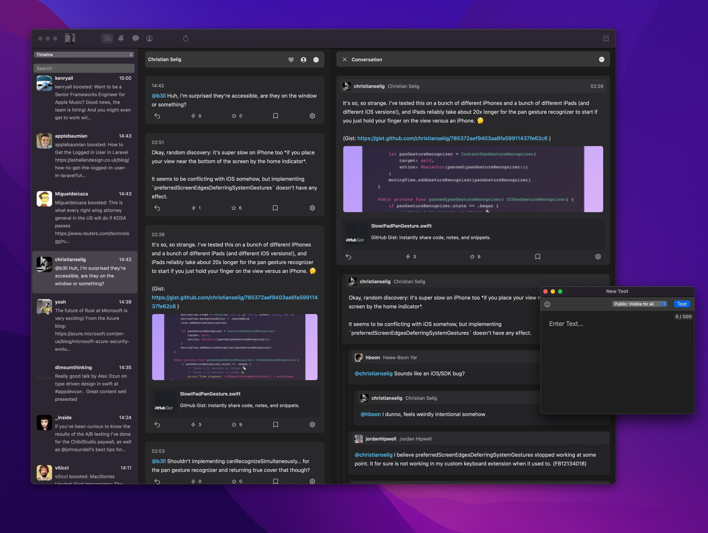
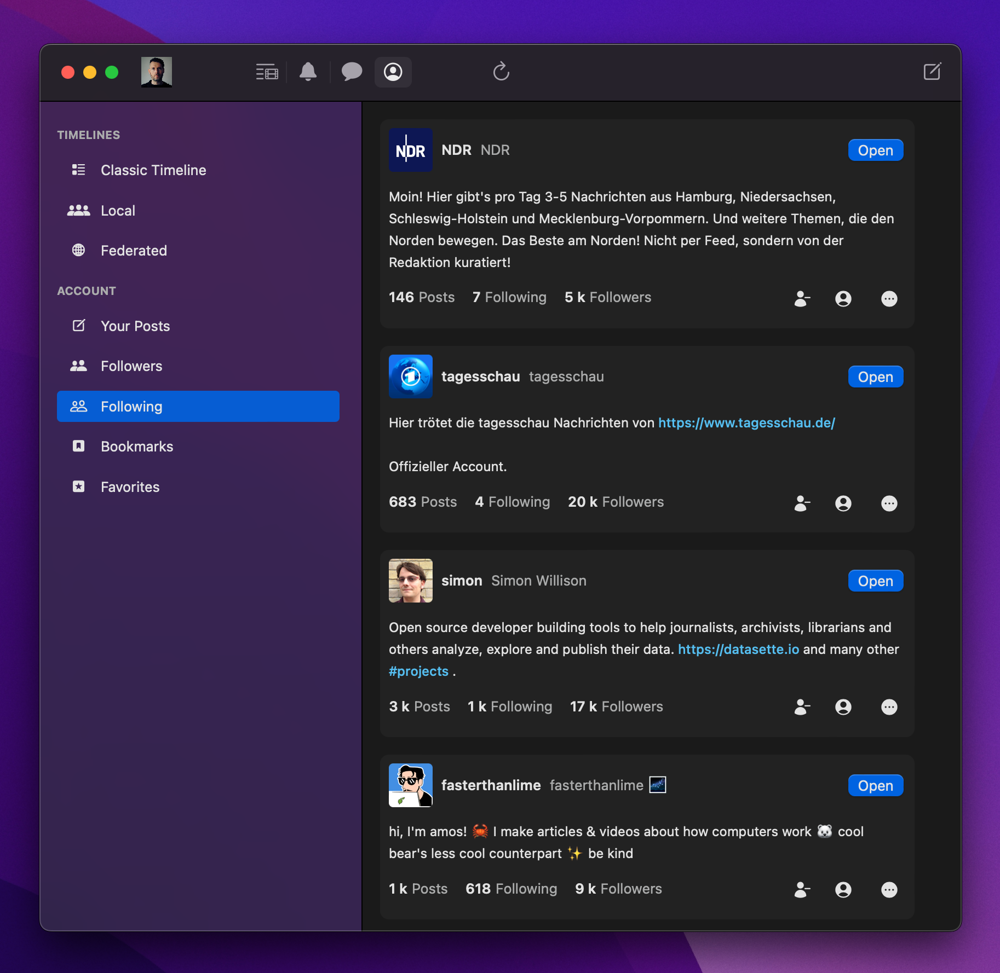
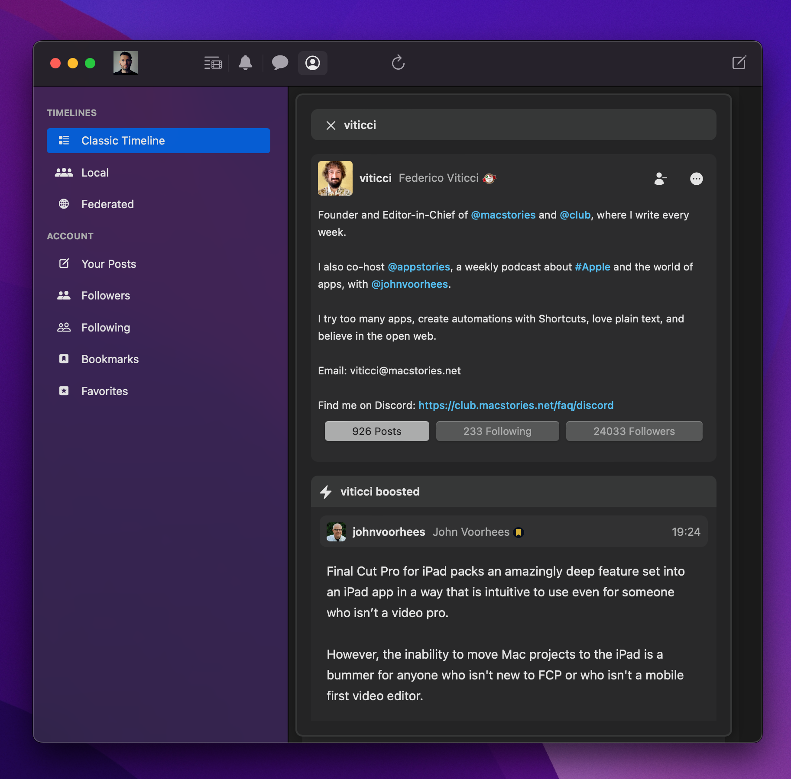
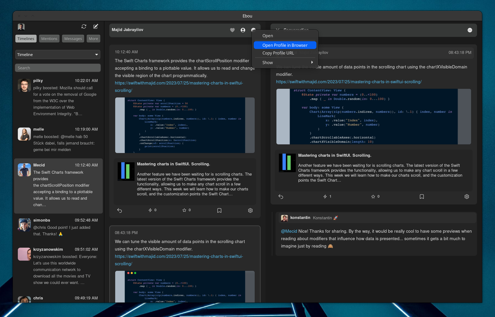

# Ebou


Ebou is a cross platform Mastodon (and Pleroma, untested) client written in Rust using the [Dioxus](https://dioxuslabs.com) UI library. It currently runs on macOS [`stable`], Windows [`beta`], and theoretically on Linux [`untested`].

Ebou is a different take on the Microblogging / Mastodon experience. It groups new Toots by author
and displays them in a UI not unlike modern messengers like Telegram, iMessage or WhatsApp.

This makes it easy to see your friends' updates at once.

It also has a **Conversation** view which helps seeing replies in the originating
context.

Ebou is currently an experiment and therefore missing some features which you might expect from a
full Mastodon client. They will be implemented over time.

You can download the current [release for macOS Testflight](https://testflight.apple.com/join/7CpOOK4w) or [in the GitHub releases](https://github.com/terhechte/Ebou/releases)

Note: I worked on Ebou in my spare time. Please judge the code not as a professional project but more like a small side project where the outcome (a working desktop client) had higher priority than beautiful, well architected, well abstracted code.

## Screenshots

Full Screenshot with Conversation Tree:



List of Followers:



Classic Timeline:



Windows Beta:


Linux Beta:



## State

Ebou is currently in a beta state. There're bugs, and there're missing features. Here's a list of currently supported Mastodon features:

- Timelines
- Super Minimal Notifications (only Mentions and Ebou doesn’t remember which ones you already saw)
- Posting (including Video / Image attachments via Dragging and Dropping images onto window)
- Conversations in a nice nested tree view
- Boost, favorite, reply, bookmark
- Lists
- Your favourites / bookmarks
- Profiles
- Settings
- Minimal Search
- Followers / Follows
- Some settings

## Dioxus

Ebou uses [Dioxus](https://dioxuslabs.com) as the UI library. Dioxus makes it easy to build functional cross platform apps, but it is also currently unfinished and lacking features. Some of the limitations of Ebou are related to missing features in Dioxus.

One particular issue I have with Dioxus is that it uses a lot of abstractions and patterns from the React world.
This leads to a lot of mixing of logic, model and ui domains.

## Navicula

Therfore, I wrote an additional abstraction on top of Dioxus which implements a reducer model where each view is
split up into the view, the state, the action / message and the reducer. It is a bit of a mix between the Elm architecture and the [Swift Composable Architecture](https://github.com/pointfreeco/swift-composable-architecture). It is called **Navicula** and a separate crate which can be found [here](https://github.com/terhechte/navicula).

## Forks

Due to the way things work, many of the dependencies that Ebou uses had the one or other issue which made it difficult to use in Ebou. Therefore (if you look at the dependencies in `Cargo.toml`) there're several forks of different crates. I plan to get these changes merged over time.

## Model Layer

One tricky issue about apps servicing microblogging services such as Twitter or Mastodon is that the data model needs to support the use case of sharing and mutating each Status (or Toot, or Tweet, or Message, I'll use the word Status now).

You could have the same Status multiple times on the screen. As a Status, and then as a boost and then in another column as one of your liked items, and then maybe in the conversation view as well. If you `star` one of them, the following needs to happen:

1. The state is temporarily changed
2. The mastodon star api is called
3. If successful the `star` should be made permanent
4. Find all the places where this particular Status is currently displayed
5. Update it in all these places
6. Redraw the related UI in these places
7. All this on different threads (because the api call will probably happen on tokio and should not block the UI)

This particular problem is a bit hard in Rust because shared mutable cross thread state can only be achived with a `Arc<Mutex<...>>` which is hard to use because everytime you'd want to read any property of it you'd need to watch out for a poisoned lock, etc.

Ebou currently doesn't have a really good solution to this problem. It has something called `RefPublisher` which keeps
all the Status data in a variety of structures. Reducers can subscribe to this `RefPublisher`. Then, whenever something in the storage changes, the view will be notified that it needs to re-render. Mutation then happens with a specific `with_mutation` function which makes sure to update all subscribers. This is not a particularly good solution because of multiple reasons:

1. It is not fine-grained enough. It should be possible to subscribe on a per Status level
2. Statuses are currently not stored as references. Instead, multiple instances can exist in memory. Something aking to a ECS might be a useful idea here
3. The `with_mutation` way is cumbersome to use.

Replacing this system with something better would go a long way towards improving the performance and reliability of Ebou.

## Javascript

There're some places where Dioxus didn't support the required functionality yet, so Ebou uses ugly javascript injection hacks to achieve some sort of effect. I can't say that I'm particularly happy about this.

## Building

``` sh
cargo run
# or
cargo run --release
```

## Signing & Releasing

### macOS

In order to create a macOS release build, we first generate a universal binary in Rust and
then let Xcode sign it. It is possible to use command line utilities to sign the binary,
but this is quite the hassle. Instead, there is an included Xcode project in the `Xcode-Container`
folder:

1. Open up the Xcode Project
2. Build an Archive
3. Open the Archive in Finder to get the path to the archive on disk
4. Call the `make.sh` script with a version number and the path, e.g. `./make.sh 700 "/Users/ben/Library/Developer/Xcode/Archives/2023-05-05/Ebou 23.05.23.xcarchive"
5. This will build Ebou and replace the binary in the Xcode archive with the actual Ebou binary
6. Go to Xcode, selected the archive in the Organizer and sign & submit it from there

### Linux

Linux requires a couple of additional dependencies.

#### Debian

``` sh
sudo apt-get install pkg-config libssl-dev libgtk-3-dev xdotool libwebkit2gtk-4.1-dev libgtk-3-0 libgtk-3-dev libxdo-dev
```

### Arch

There's a AUR package for Arch Linux:

[https://aur.archlinux.org/packages/ebou-git](https://aur.archlinux.org/packages/ebou-git)

Thanks to [https://github.com/StandingPadAnimations](StandingPadAnimations)

### Fedora

``` sh
# Untested
dnf install pkg-config openssl-devel gtk3 gtk3-devel webkit2gtk4.1-devel xdotool xdotool-devel
```

## License

Ebou is licensed under the [GPL License](LICENSE)
